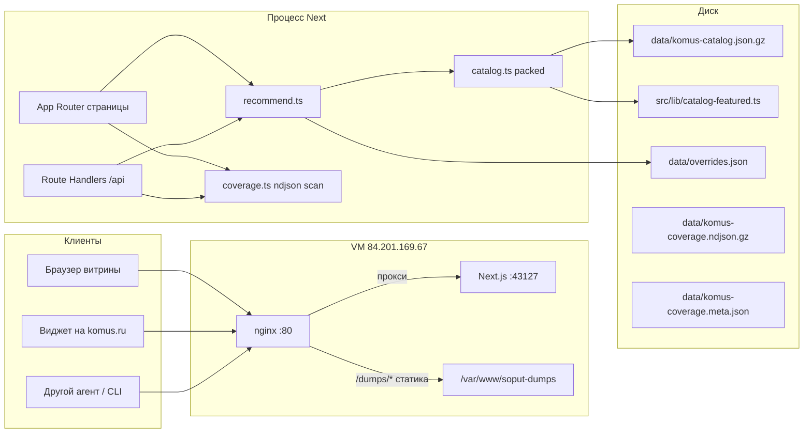

# Архитектура сервиса Сопут

Сопут — однопроцессное Next.js-приложение, которое к карточке товара komus.ru подбирает **сопутствующие SKU** (расходники, совместимость, «с этим покупают»), а не подмены из той же полки.

Публичный контур: `http://84.201.169.67/` (nginx :80 → Next на `127.0.0.1:43127`). Исходный код: [github.com/iltarus/SOPUT](https://github.com/iltarus/SOPUT).

## 1. Контекст и ограничения

| Решение | Почему так |
|---|---|
| Нет БД, нет auth | Каталог статичен, мерчандайзерские правки — JSON на диске |
| Нет живого API Комус | Partner XML и HTML PDP режет антибот (503 без cookie) |
| Каталог из sitemap | `https://www.komus.ru/sitemap.xml` → `/sitemap/{0–32}.xml` |
| Имена из транслита slug | В sitemap нет витринного title, цен и остатков |
| Packed in-memory + gzip на диске | ~170 тыс. SKU должны помещаться в VM ~2 ГБ |
| Офлайн-снимок покрытия | `recommend()` по всем SKU нельзя считать на каждый HTTP-запрос |

## 2. Стек

- **Runtime:** Node.js 22, Next.js 16 App Router, React 19
- **UI:** Tailwind 4, shadcn/ui (Button, Input, Dialog, Sheet, …)
- **Язык:** TypeScript; сборка каталога — Python 3
- **Тесты:** `tsx --test src/lib/recommend.test.ts`
- **Деплой:** systemd `soput.service` (`npm start`, `NODE_OPTIONS=--max-old-space-size=1280`, `MemoryMax=1500M`) + nginx

Порт разработки и продакшена один: **43127**, bind на localhost.

## 3. Высокоуровневая схема



## 4. Каталог

### 4.1. Источники

1. **Sitemap-дамп** `data/komus-catalog.json.gz` — ~169 897 строк `{id,n,b,d,c,p,i}`. Сборка: `npm run catalog:build` ← XML в `/tmp/komus-sitemaps/{0..32}.xml`.
2. **Featured-срез** `src/lib/catalog-featured.ts` — ~99 размеченных SKU с ценами, тегами, OEM, совместимостью. Часть id **нет в sitemap** (например `148201`): в приложении они есть, ссылка на Комус идёт в поиск, не на выдуманный `/p/{id}/`.

`src/lib/catalog.ts` склеивает оба источника: extras (featured, которых нет в gzip) первыми, затем packed-строки sitemap. Итог в UI: **169 995** карточек.

### 4.2. Packed-гидратация

Полный JSON каталога в объекты `Product` не поднимается. В памяти:

- сырые строки sitemap;
- haystack-строки для поиска;
- `Map` id → строка.

`getProduct` и окно `queryProducts` гидратируют только нужные карточки. Featured-поля накладываются, если id совпал.

Поиск: подстрока по id / названию / бренду / категории / пути. Лимит страницы API: 1–96 (по умолчанию 48).

### 4.3. URL на komus.ru

`komusCatalogUrl` в `src/lib/format.ts`:

- есть `path` из sitemap и числовой id → `https://www.komus.ru/p/{id}/`;
- иначе → `https://www.komus.ru/search?text=…` (бренд + имя, без внутреннего demo-id).

Цена `0` на витрине показывается как «Цена на komus.ru».

## 5. Движок рекомендаций

Модуль `src/lib/recommend.ts`. **Не** сканирует 170k SKU на каждый запрос. Кандидаты собираются из узких пулов.

### 5.1. Пул кандидатов

| Источник | Где | Зачем |
|---|---|---|
| Совместимость SKU | `src/lib/compatibility.ts` | OEM-расходник к модели (в основном featured) |
| Keyword HINTS | regex по имени/категории/пути источника → пул по токенам | Живой sitemap без точных названий категорий |
| Отделы | `DEPT_COMPLEMENT` + `collectByDepartment` | Запасной комплект, если HINTS не сработали |
| Пины мерчандайзера | `data/overrides.json` | Принудительно в пул |

Пулы HINTS считаются при старте процесса: **отдельный collect на каждый токен** (до 80 SKU), токен ищется с границей слова (`hasToken`), услуги (`заправка`, `восстановлен`, `ремонт`, `nashi-uslugi`) в пул не попадают.

### 5.2. Скоринг

`scoreCandidate` суммирует веса. Кандидат отбрасывается, если нет причин кроме «в наличии» или итоговый score < 12 (и это не пин).

Порядок влияния (типичные веса):

1. **Пин** — `1000 − index×15`
2. **Compat** — `92 × strength`
3. **Чужой расходник** (картридж другой модели) — −55
4. **Правило категорий** `findRule` — `48 × weight` (нечёткое вхождение названия категории)
5. **Affinity** (синтетические корзины) — если пара встречалась ≥ 5 раз
6. **Тот же бренд**, не Комус, другая категория — +8
7. **Keyword HINT** — `36 × weight`
8. **Связка отделов** — `32 × weight`, **только если keyword не сработал** (иначе стол получает придверные коврики вместо кресел)
9. **Атрибуты** (format, oem, …) — только вместе с compat или rule
10. **Наличие** — +5 / −22
11. **Подмена** (та же категория, нет compat/affinity, не пин) — −28

Группы выдачи: `pinned` → `consumables` → `equipment` → `together`.

`diversify`: не больше 4 расходников одной категории и 2 в остальных, затем добор до `limit`.

### 5.3. Корзина

`recommendForCart(ids)` вызывает `recommend` по каждому id с `excludeIds = ids`, сливает score, режет дубли.

Клиентская корзина — `localStorage` ключ `soput-cart` (`src/components/cart-provider.tsx`), серверу не пишется.

## 6. Покрытие

Офлайн-прогон `npm run coverage:build` (`scripts/build-coverage.ts`): для каждого id каталога `recommend(id, {limit:8})`.

Пишет:

- `data/komus-coverage.json.gz` — JSON для агентов и `GET /api/catalog/coverage`;
- `data/komus-coverage.ndjson.gz` — по строке на SKU, так читает приложение;
- `data/komus-coverage.meta.json` — KPI без разжатия снимка.

Приложение **не** делает `JSON.parse` всего массива: `src/lib/coverage.ts` сканирует ndjson построчно. Иначе процесс на 1.3 ГБ куче падает OOM.

KPI витрины: `(full + ok) / total`. Метка по числу сопутствующих в снимке: ≥6 полное, 3–5 достаточное, 1–2 слабое, 0 пусто. На живой PDP `coverageOf` смотрит ещё на наличие групп расходников/together — это другой индикатор.

## 7. HTTP-поверхность

Все API — `export const dynamic = "force-dynamic"`, данные с диска/из памяти процесса.

| Метод | Путь | Назначение |
|---|---|---|
| GET | `/api/products` | Поиск/пагинация каталога |
| GET | `/api/products/{id}` | Карточка + related |
| GET | `/api/products/{id}/related` | Виджет сопутки |
| POST | `/api/cart/related` | Сопутка к набору id |
| GET/POST | `/api/overrides` | Пины и скрытия |
| GET | `/api/rules` | Правила категорий |
| GET | `/api/coverage` | Снимок покрытия |
| GET | `/api/catalog` | Локатор дампа для агентов |
| GET | `/api/catalog/dump` | Скачать gzip каталога |
| GET | `/api/catalog/coverage` | Скачать gzip покрытия |

Страницы: `/`, `/p/[id]`, `/workbench`, `/workbench/[id]`, `/rules`, `/coverage`, `/cart`, `/docs`.

Статика дампов (минуя Next): `/dumps/komus-catalog.json.gz`, `/dumps/HANDOFF.md`, `/dumps/catalog-locator.json`.

## 8. Слои UI

```
layout.tsx (тема, шрифты)
  AppShell (навигация, CartProvider)
    page.tsx / p/[id] / workbench / coverage / cart / docs / rules
      клиентские браузеры: CatalogBrowser, CoverageBrowser, WorkbenchEditor
        fetch /api/*  (каталог нельзя импортировать в клиент — fs + gzip)
```

Серверные модули с `fs` (`catalog.ts`, `coverage.ts`, `overrides.ts`) **нельзя** импортировать из `"use client"` компонентов: RSC отдаст 170k или упрётся в Node API.

## 9. Данные на диске

```
data/
  komus-catalog.json.gz      # мастер SKU
  komus-catalog.meta.json
  komus-catalog.sample.json
  komus-coverage.json.gz     # полный JSON снимка сопутки
  komus-coverage.ndjson.gz   # то же построчно для рантайма
  komus-coverage.meta.json   # KPI
  overrides.json             # пины/скрытия
  HANDOFF.md                 # контракт для других агентов
```

Пересборка каталога и покрытия — ручная, не в HTTP-запросе.

## 10. Что сознательно отсутствует

- Учётные записи, роли, аудит
- Реляционная БД и очередь
- Живые цены, остатки, partner feed Комус
- HTTPS на публичной VM (сейчас HTTP :80)
- Полнотекстовый индекс (Elastic и т.п.) — подстрока по haystack
